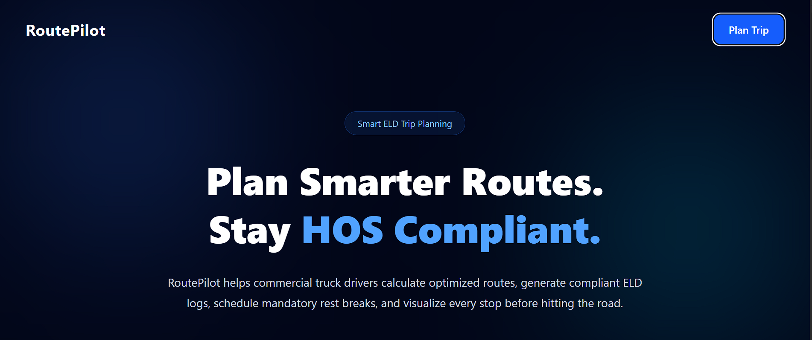
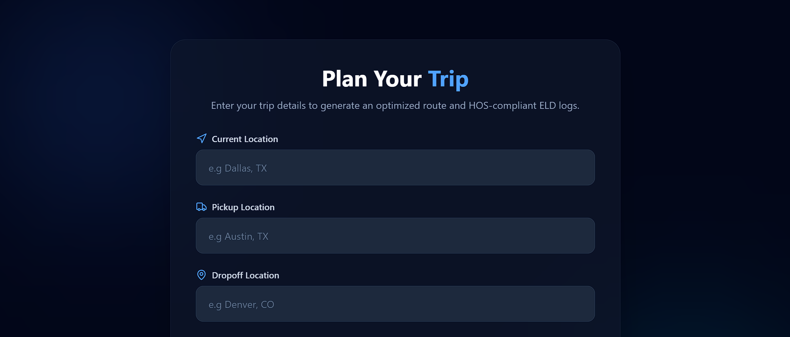

# RoutePilot 🚛

RoutePilot is a full-stack trip planning application designed for commercial truck drivers. It helps drivers plan trips while staying compliant with Electronic Logging Device (ELD) Hours of Service (HOS) regulations. The application generates optimized routes, recommends rest and fuel stops, and visualizes daily ELD logs.

---

## Features

- 📍 Select current, pickup, and drop-off locations
- 🗺️ Interactive map with route visualization
- 🚚 Route planning using GraphHopper
- ⛽ Automatic fuel stop recommendations
- 😴 Driver rest stop recommendations
- 📋 Electronic Logging Device (ELD) log generation
- 📊 Trip summary dashboard
- 📈 Hours of Service (HOS) calculations
- ⚠️ Driver violation detection
- 🌐 Responsive React interface

---

## Tech Stack

### Frontend

- React
- React Router
- React Leaflet
- Leaflet
- Tailwind CSS
- Framer Motion
- Lucide React

### Backend

- Django
- Django REST Framework

### APIs & Services

- GraphHopper Routing API
- OpenStreetMap
- Nominatim Geocoding API

---

## Project Structure

```
RoutePilot/
│
├── frontend/
│   ├── src/
│   ├── public/
│   └── package.json
│
├── backend/
│   ├── eldloggersite/
│   ├── trip_planner/
│   ├── manage.py
│   └── requirements.txt
│
└── README.md
```

---

## Installation

### Clone the repository

```bash
git clone https://github.com/jahanzaib504/routepilot.git

cd routepilot
```

---

## Backend Setup

Create a virtual environment.

```bash
python -m venv venv
```

Activate it.

### Windows

```bash
venv\Scripts\activate
```

### Linux / macOS

```bash
source venv/bin/activate
```

Install dependencies.

```bash
pip install -r requirements.txt
```

Create a `.env` file inside the backend directory.

```env
api_key=your_api_key
DEBUG=True
```

Run migrations.

```bash
python manage.py migrate
```

Start the Django server.

```bash
python manage.py runserver
```

The backend will run on:

```
http://127.0.0.1:8000
```

---

## Frontend Setup

Navigate to the frontend.

```bash
cd frontend
```

Install packages.

```bash
npm install
```

Create a `.env` file.

```env
VITE_API_URL=http://localhost:8000
```

Run the development server.

```bash
npm run dev
```

The frontend will run on:

```
http://localhost:5173
```

---

## Environment Variables

### Backend

| Variable | Description |
|----------|-------------|
| DEBUG | Django debug mode |
| api_key | GraphHopper API key |

### Frontend

| Variable | Description |
|----------|-------------|
| VITE_API_URL | Backend API URL |

---

## Screenshots
Home Page


Trip Planner Page


Results Page

---

## API Endpoints

### Calculate Trip

```
POST /trip_planner/post_data
```

Example Request

```json
{
    "current": {
        "lat": 24.8607,
        "lng": 67.0011
    },
    "pickup": {
        "lat": 24.9000,
        "lng": 67.1000
    },
    "dropoff": {
        "lat": 25.0000,
        "lng": 67.2000
    },
    "cycle_hour": 5,
    "current_time": 10.5
}
```

---

## Roadmap

- [x] Route planning
- [x] Interactive map
- [x] ELD log visualization
- [x] Fuel stop recommendations
- [x] Rest stop recommendations
- [ ] User authentication
- [ ] Trip history
- [ ] PDF report export
- [ ] Driver profile
- [ ] Multi-day trip planning

---

## Future Improvements

- Google Maps integration
- Live traffic information
- Weather along the route
- Fleet management
- Fuel price optimization
- Offline map support
- Driver analytics dashboard

---

## License

This project was developed as part of a Full Stack Developer assessment and is intended for educational and demonstration purposes.

---

## Author

**Jahanzaib Awan**

GitHub: https://github.com/jahanzaib504

LinkedIn: https://linkedin.com/in/jahanzaib-arif-awan